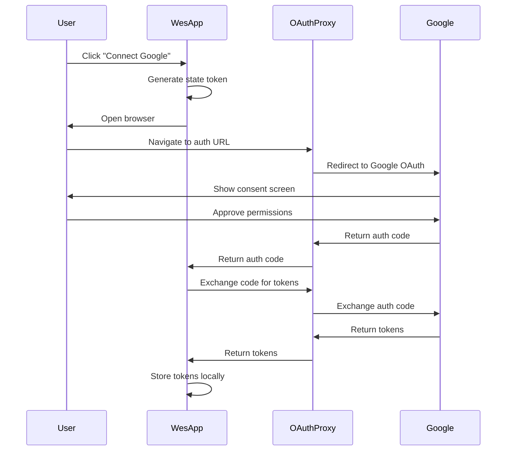

# OAuth Proxy Implementation Specification

## Overview

This specification details the implementation of a centralized OAuth proxy service for Wes that eliminates the need for users to configure Google Cloud credentials.

## System Architecture

### Components

1. **OAuth Proxy Service** (Cloud-hosted)
   - Handles OAuth flow with Google
   - Exchanges authorization codes for tokens
   - Stateless, no user data storage
   - Rate limiting and security

2. **Wes Client Updates**
   - Modified OAuth handler
   - Proxy communication
   - Token management
   - Fallback mechanisms

3. **Configuration Service**
   - Stores Wes OAuth app credentials
   - Environment-based configuration
   - Security monitoring

### Data Flow



## Detailed Implementation

### 1. OAuth Proxy Service

#### Technology Stack
- **Runtime**: Python 3.11+ with FastAPI
- **Hosting**: Vercel/AWS Lambda (serverless)
- **Security**: HTTPS, CORS, rate limiting

#### API Endpoints

```python
# GET /auth/google
# Initiates OAuth flow
@app.get("/auth/google")
async def start_oauth(
    state: str = Query(..., description="CSRF protection token"),
    redirect_uri: str = Query(..., description="Client callback URL")
):
    """
    Returns redirect URL to Google OAuth consent page
    """
    
# GET /callback/google
# Handles Google OAuth callback
@app.get("/callback/google")
async def oauth_callback(
    code: str = Query(...),
    state: str = Query(...)
):
    """
    Receives auth code from Google, redirects to client
    """
    
# POST /token/exchange
# Exchanges authorization code for tokens
@app.post("/token/exchange")
async def exchange_token(
    code: str,
    state: str,
    client_id: str = Header(None, alias="X-Client-Id")
):
    """
    Exchanges auth code for access/refresh tokens
    Returns tokens to client, never stores them
    """
```

#### Security Implementation

```python
class SecurityMiddleware:
    def __init__(self):
        self.rate_limiter = RateLimiter(
            max_requests=100,
            window_seconds=3600
        )
        self.allowed_origins = [
            "app://wes",
            "http://localhost:*"
        ]
    
    async def validate_request(self, request: Request):
        # Rate limiting
        client_ip = request.client.host
        if not self.rate_limiter.allow(client_ip):
            raise HTTPException(429, "Rate limit exceeded")
        
        # CORS validation
        origin = request.headers.get("Origin")
        if origin and origin not in self.allowed_origins:
            raise HTTPException(403, "Origin not allowed")
        
        # State validation (CSRF protection)
        # Additional security checks
```

### 2. Wes Client Updates

#### New SimplifiedOAuthHandler

```python
class SimplifiedOAuthHandler(QObject):
    """Simplified OAuth handler using Wes proxy service"""
    
    auth_complete = Signal(dict)
    auth_error = Signal(str)
    
    PROXY_URL = "https://oauth.wes-app.com"
    FALLBACK_ENABLED = True
    
    def __init__(self, config_manager=None):
        super().__init__()
        self.config_manager = config_manager
        self.fallback_handler = GoogleOAuthHandler(config_manager)
    
    def start_auth(self):
        """Start simplified OAuth flow"""
        try:
            # Check if proxy is available
            if not self._check_proxy_available():
                if self.FALLBACK_ENABLED:
                    return self._use_fallback()
                raise Exception("OAuth proxy unavailable")
            
            # Generate secure state
            self.state = secrets.token_urlsafe(32)
            
            # Build auth URL
            auth_url = f"{self.PROXY_URL}/auth/google"
            params = {
                "state": self.state,
                "redirect_uri": "http://localhost:8080/callback"
            }
            
            # Open browser
            webbrowser.open(f"{auth_url}?{urlencode(params)}")
            
            # Start local callback server
            self._start_callback_server()
            
        except Exception as e:
            self.auth_error.emit(str(e))
    
    def _exchange_code(self, code: str, state: str):
        """Exchange auth code via proxy"""
        try:
            response = requests.post(
                f"{self.PROXY_URL}/token/exchange",
                json={"code": code, "state": state},
                headers={
                    "X-Client-Id": self._get_client_id(),
                    "User-Agent": f"Wes/{VERSION}"
                },
                timeout=30
            )
            
            if response.status_code == 200:
                tokens = response.json()
                self._store_tokens(tokens)
                self.auth_complete.emit(tokens)
            else:
                raise Exception(f"Token exchange failed: {response.text}")
                
        except Exception as e:
            self.auth_error.emit(str(e))
```

#### Configuration Updates

```python
class GoogleAuthConfig:
    """Configuration for Google authentication"""
    
    def __init__(self):
        self.auth_method = self._detect_auth_method()
        self.proxy_enabled = True
        self.manual_config = None
    
    def _detect_auth_method(self):
        """Auto-detect best auth method"""
        # 1. Check for service account (enterprise)
        if self._has_service_account():
            return "service_account"
        
        # 2. Check for manual OAuth config
        if self._has_manual_oauth():
            return "manual_oauth"
        
        # 3. Default to simplified proxy
        return "proxy_oauth"
    
    def get_auth_handler(self):
        """Get appropriate auth handler"""
        if self.auth_method == "proxy_oauth":
            return SimplifiedOAuthHandler()
        elif self.auth_method == "manual_oauth":
            return GoogleOAuthHandler()
        elif self.auth_method == "service_account":
            return ServiceAccountHandler()
```

### 3. UI Updates

#### Simplified Connection Flow

```python
class GoogleConnectionWidget(QWidget):
    """Simplified Google connection UI"""
    
    def __init__(self):
        super().__init__()
        self.setup_ui()
    
    def setup_ui(self):
        layout = QVBoxLayout()
        
        # Simple connect button
        self.connect_btn = QPushButton("Connect Google Account")
        self.connect_btn.clicked.connect(self.start_connection)
        
        # Status label
        self.status_label = QLabel("Not connected")
        
        # Advanced options (collapsed by default)
        self.advanced_group = QGroupBox("Advanced Options")
        self.advanced_group.setCheckable(True)
        self.advanced_group.setChecked(False)
        
        advanced_layout = QVBoxLayout()
        self.manual_config_btn = QPushButton("Configure Manually")
        self.manual_config_btn.clicked.connect(self.show_manual_config)
        advanced_layout.addWidget(self.manual_config_btn)
        
        self.advanced_group.setLayout(advanced_layout)
        
        layout.addWidget(self.connect_btn)
        layout.addWidget(self.status_label)
        layout.addWidget(self.advanced_group)
        
        self.setLayout(layout)
    
    def start_connection(self):
        """Start simplified connection flow"""
        self.auth_handler = SimplifiedOAuthHandler()
        self.auth_handler.auth_complete.connect(self.on_auth_complete)
        self.auth_handler.auth_error.connect(self.on_auth_error)
        
        self.connect_btn.setEnabled(False)
        self.status_label.setText("Connecting...")
        
        self.auth_handler.start_auth()
```

### 4. Security Considerations

#### Token Storage

```python
class SecureTokenStorage:
    """Secure storage for OAuth tokens"""
    
    def __init__(self, security_manager):
        self.security_manager = security_manager
        self.service_name = "wes_google_oauth"
    
    def store_tokens(self, tokens: dict):
        """Store tokens securely"""
        # Encrypt sensitive data
        encrypted = self.security_manager.encrypt_credential(
            json.dumps({
                "access_token": tokens["access_token"],
                "refresh_token": tokens["refresh_token"],
                "expires_at": tokens.get("expires_at")
            })
        )
        
        # Store in keyring
        keyring.set_password(
            self.service_name,
            "tokens",
            encrypted
        )
        
        # Store non-sensitive data
        config = {
            "token_type": tokens.get("token_type", "Bearer"),
            "scope": tokens.get("scope", ""),
            "authenticated_at": datetime.now().isoformat()
        }
        self._save_config(config)
```

#### Proxy Security

- HTTPS only with TLS 1.3
- Certificate pinning in client
- Rate limiting: 100 requests/hour per IP
- CORS restricted to Wes applications
- No user data logging
- Stateless operation

### 5. Migration Plan

#### Phase 1: Soft Launch (Week 1-2)
- Deploy proxy service
- Release Wes update with opt-in flag
- Monitor usage and errors

#### Phase 2: Default for New Users (Week 3-4)
- Enable proxy auth by default for new installations
- Keep manual config as option
- Update documentation

#### Phase 3: Migration Prompt (Week 5-6)
- Prompt existing users to try simplified auth
- Provide easy migration path
- Maintain backward compatibility

#### Phase 4: General Availability (Week 7+)
- Proxy auth as primary method
- Manual config in advanced settings
- Enterprise documentation for alternatives

### 6. Monitoring and Analytics

```python
class ProxyMonitoring:
    """Monitoring for OAuth proxy service"""
    
    def track_metrics(self):
        metrics = {
            "auth_attempts": Counter(),
            "auth_success": Counter(),
            "auth_failures": Counter(),
            "token_exchanges": Counter(),
            "response_times": Histogram(),
            "error_types": Counter()
        }
        
    def alert_conditions(self):
        alerts = [
            ("High failure rate", lambda: self.failure_rate > 0.1),
            ("Slow response", lambda: self.p95_response_time > 5.0),
            ("Rate limit hits", lambda: self.rate_limit_hits > 100)
        ]
```

## Success Criteria

1. **User Experience**
   - Time to authenticate: < 90 seconds
   - Success rate: > 95%
   - User errors: < 5%

2. **Technical**
   - Proxy uptime: 99.9%
   - Response time: < 500ms p95
   - Token exchange success: > 99%

3. **Security**
   - No security incidents
   - No credential leaks
   - Compliance with Google OAuth policies

## Conclusion

This implementation provides a zero-configuration OAuth experience while maintaining security and flexibility. The proxy service acts as a thin layer that simplifies the authentication process without storing user data or credentials.